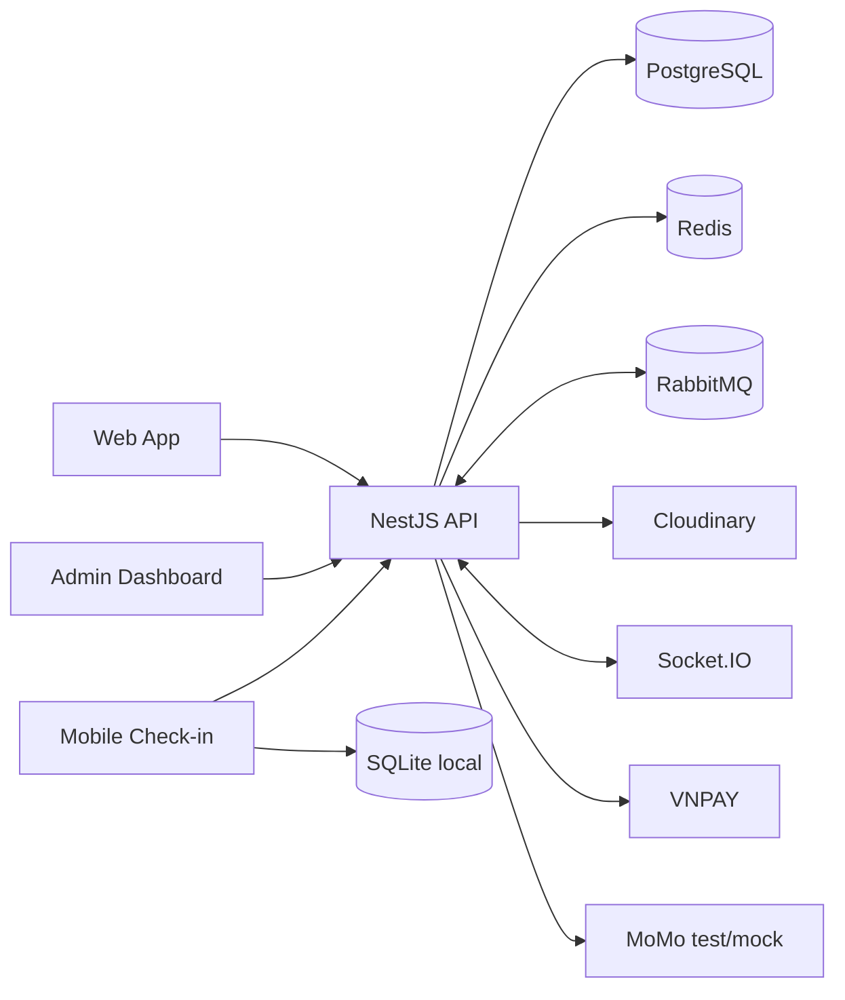

# TicketBox — Thiết kế kỹ thuật hiện tại

## 1. Kiến trúc tổng thể
TicketBox là modular monolith NestJS phục vụ ba client:
- Web React cho khán giả.
- Admin Dashboard React cho `ADMIN` và `ORGANIZER`.
- Mobile Check-in Expo/React Native.

Backend chia module Auth, Concert, Booking, Payment, Notification, Check-in, CSV, AI, Storage, Ticket và Admin. Dữ liệu giao dịch nằm trong PostgreSQL qua Prisma; Redis, RabbitMQ, cron và Socket.IO hỗ trợ cache, khóa, job nền và cập nhật realtime.

## 2. Xác thực và phân quyền
- Đăng nhập email/mật khẩu, JWT access token và refresh token rotation.
- Access token mặc định 15 phút; refresh token mặc định 14 ngày.
- Token của `CHECK_IN_STAFF` không có `exp` để hỗ trợ offline.
- Role: `AUDIENCE`, `ORGANIZER`, `CHECK_IN_STAFF`, `ADMIN`.
- Role guard được dùng rộng rãi; event-scope guard mới chỉ dùng ở demo, nhiều service tự kiểm tra ownership.

## 3. Concert, admin và cache
- Concert public chỉ trả bản ghi `PUBLISHED`.
- Organizer/Admin có thể CRUD concert, ticket type, show, artist và gate.
- Admin module cung cấp stats, job, guest list, artist, venue và quản lý user/staff.
- Redis cache-aside chỉ áp dụng cho list/detail concert, TTL mặc định 300 giây cộng jitter và mutex chống thundering herd.
- Analytics đọc trực tiếp PostgreSQL; chưa có read model, replica hoặc audit log thay đổi.

## 4. Booking và availability
- Redis khóa ghế 15 phút và dùng mutex theo show khi tạo booking.
- PostgreSQL transaction cập nhật ghế, inventory và coupon; `soldQuantity` dùng conditional update để phát hiện cạnh tranh.
- Booking `PENDING_PAYMENT` hết hạn sau 15 phút; cron mỗi phút hủy và hoàn tài nguyên.
- Socket.IO phát `seats_updated`, chưa có version/order field.
- Chưa có waiting queue, admission control hoặc Redis Lua inventory.

## 5. Payment
- Tạo Payment từ booking pending; payment create chưa idempotent.
- VNPAY có URL ký HMAC và webhook kiểm tra checksum, amount, payment status; thành công tạo ticket và publish notification.
- MoMo hiện là integration test/mock, chưa có IPN/controller hoàn tất giao dịch và `verifyWebhook()` luôn trả true.
- Booking không lưu `showId`; vé không chọn ghế đang fallback sang show đầu tiên của concert.

## 6. Notification
- RabbitMQ nhận `payment.success`; consumer tạo email và in-app notification.
- Retry provider tối đa 3 lần; queue có DLX/DLQ và handler republish.
- Cron gửi email reminder T-24h.
- Notification lưu PostgreSQL và được emit realtime qua Socket.IO.
- Chưa có idempotency, attempt audit, user preference hoặc xác thực socket room.

## 7. Check-in
- QR là JWT RS256; mobile dùng public key từ biến môi trường.
- Mobile tải vé vào SQLite không mã hóa, kiểm tra sự kiện, duplicate và gate khi offline.
- Online/sync chỉ kích hoạt khi có Wi-Fi.
- Backend kiểm tra gate và first-valid-check-in; trả outcome từng vé.
- Mobile hiện đánh dấu toàn bộ batch đã sync sau response thành công, chưa lưu outcome riêng hoặc idempotency theo scan/batch.

## 8. CSV Guestlist
- Admin/Organizer tạo job từ `showId + fileUrl`; cron 02:00 hoặc thao tác admin publish RabbitMQ.
- Worker xử lý chunk 100 dòng, upsert user, dedup theo user/show, khóa ghế và tạo vé miễn phí.
- Kết quả/failed rows lưu trong JSON của `BackgroundJob`.
- Chưa có file-hash idempotency, reprocess API, ownership check hoặc allowlist URL.

## 9. AI Artist Bio
- Upload PDF tạo RabbitMQ job; Python trích xuất text/avatar; provider AI sinh `name + bio`.
- Kết quả tạo/cập nhật trực tiếp Artist và liên kết concert.
- Chưa có draft/review/publish, metadata đầy đủ, ownership check, cancel/retry API hoặc quality artifact.

## 10. API protection và vận hành
- Global throttler: 100 HTTP request/phút cho mỗi instance.
- Chưa dùng Redis distributed rate limit, token bucket, sliding window, CAPTCHA hoặc waiting room.
- Circuit breaker/retry có ở payment provider, AI và Cloudinary nhưng state breaker nằm trong từng instance.
- Chưa có load-test chứng minh mục tiêu 80.000 user/5 phút, outbox, distributed tracing hoặc production monitoring.

## 11. Điểm rủi ro quan trọng
- MoMo chưa hoàn chỉnh và vé GA có thể gán sai show.
- Một số API organizer thiếu ownership check; CSV URL có rủi ro SSRF.
- Socket room notification không xác thực user.
- Redis bị `flushall()` khi một backend instance shutdown.
- Payment create, notification và check-in sync chưa có idempotency đầy đủ.
