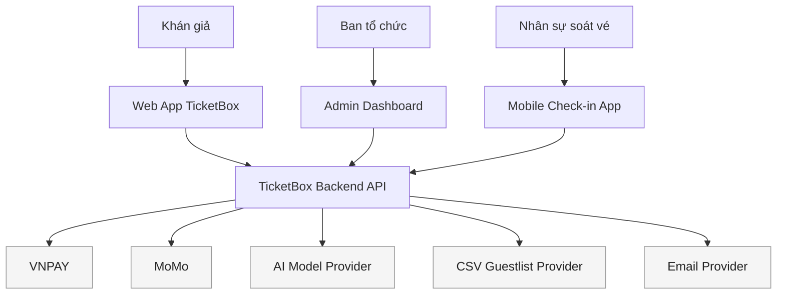
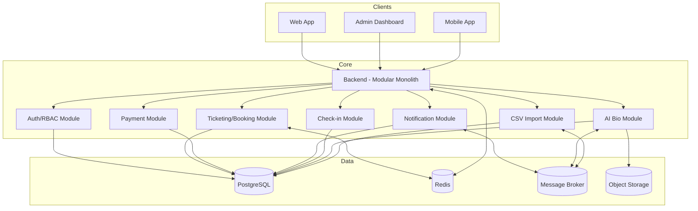
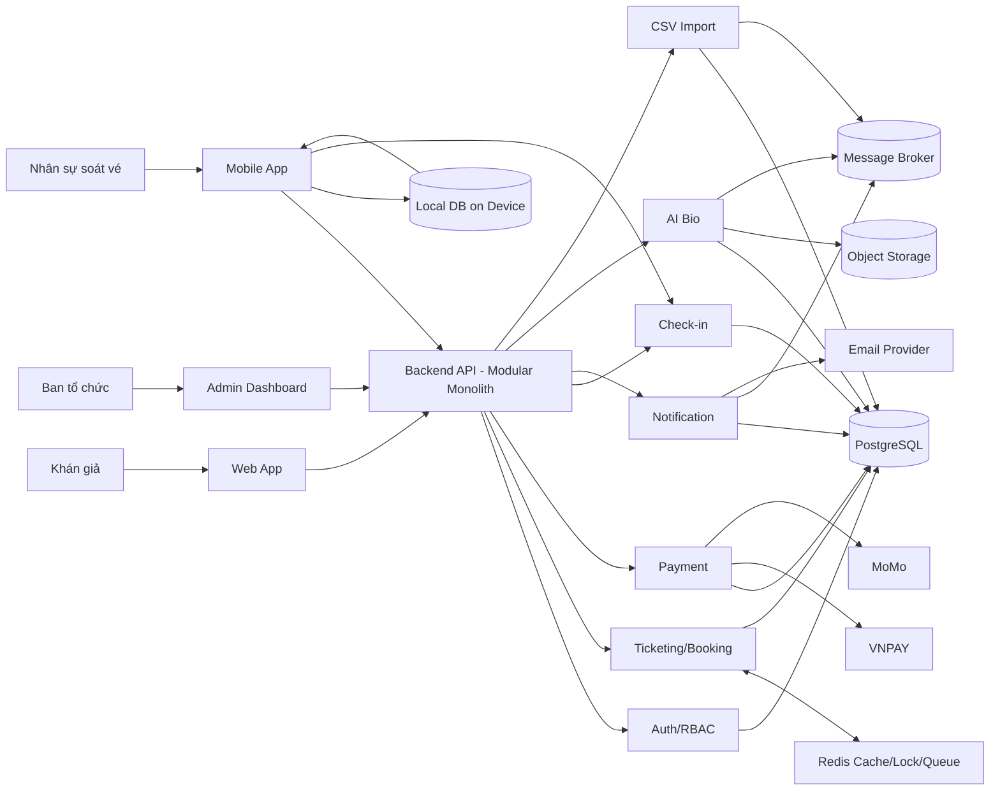

# TicketBox — Technical Design

## Kiến trúc tổng thể
Hệ thống dùng **modular monolith**: một backend triển khai đơn khối nhưng chia module rõ ràng theo năng lực, giảm độ phức tạp phân tán và phù hợp quy mô đồ án. Backend là điểm vào chính (API) cho Web/Admin/Mobile, kết hợp Redis để cache/lock/queue và Message Broker cho xử lý nền. Các thành phần chính:
- **Web App** (khán giả) và **Admin Dashboard** (ban tổ chức) giao tiếp trực tiếp với Backend API.
- **Mobile Check-in App** giao tiếp với Backend API, hỗ trợ offline với local DB.
- **Backend Modular Monolith** gồm các module: Auth/RBAC, Ticketing/Booking, Payment, Notification, Admin/Content, Check-in, AI Bio, CSV Import.
- **Data Layer**: PostgreSQL (giao dịch), Redis (cache/lock/queue/ratelimit), Object Storage (PDF), Message Broker (RabbitMQ/Kafka).

### Bounded Contexts (phân vùng ngữ cảnh)
- **Identity & Access**: xác thực, RBAC, phiên đăng nhập, phân quyền theo event.
- **Catalog & Event Management**: concert, sơ đồ ghế, cấu hình vé, nội dung nghệ sĩ.
- **Booking & Inventory**: queue, reservation TTL, khóa phân tán, giới hạn per-user.
- **Payment**: VNPAY/MoMo, idempotency, timeout, circuit breaker, webhook.
- **Notification**: in-app/email/reminder, template, retry queue.
- **Check-in**: quét QR, offline sync, conflict resolution.
- **VIP Guestlist**: import CSV, dedup, audit log.
- **AI Artist Bio**: upload PDF, extract, clean, generate, review/publish.

### Lý do chọn modular monolith
- **Phù hợp quy mô đồ án**: giảm overhead triển khai, vẫn tách bạch domain rõ ràng.
- **Đảm bảo nhất quán giao dịch**: booking + payment + inventory xử lý trong cùng tiến trình, tránh độ trễ mạng.
- **Dễ kiểm soát độ phức tạp**: log, tracing, test tích hợp đơn giản hơn microservices.
- **Sẵn sàng mở rộng**: khi cần có thể tách module thành service riêng mà không đổi domain model.

Nguyên tắc thiết kế:
- **Tách luồng đọc/ghi**: read models hoặc cache-aside để giảm tải DB trong cao điểm.
- **Không oversell**: lock phân tán + optimistic lock + reservation TTL.
- **Chống double-charge**: idempotency key cho mọi giao dịch thanh toán.
- **Event-driven**: notification, AI processing, CSV import chạy nền.
- **Đơn khối phân module**: module chỉ giao tiếp qua interface nội bộ, không gọi trực tiếp DB của nhau.

## Bản đồ năng lực (Capabilities)
- **Ticket Booking System**: queue khi cao tải, reservation TTL, khóa phân tán, cập nhật real-time availability.
- **Payment Processing System**: VNPAY/MoMo, idempotency, timeout, retry, circuit breaker, webhook security.
- **Offline Ticket Check-in**: offline scan, local persistence, sync, conflict resolution.
- **Notification System**: in-app, email, delayed reminders, retry queue, provider abstraction.
- **Admin Dashboard**: quản trị concert, cấu hình vé, thống kê, audit log.
- **AI Artist Bio System**: upload PDF, trích xuất, làm sạch, AI tóm tắt, review/publish.
- **CSV Guestlist Import**: scheduled + manual import, validation, dedup, audit.
- **API Protection System**: rate limiting, anti-bot, chuẩn hóa 429.
- **Concert Cache System**: cache-aside Redis, TTL phân tầng, invalidation.
- **Authentication & RBAC**: JWT, refresh rotation, role-based guards.

### Mapping Bounded Context → Module
- Identity & Access → Auth/RBAC Module
- Catalog & Event Management → Admin/Content Module
- Booking & Inventory → Ticketing/Booking Module
- Payment → Payment Module
- Notification → Notification Module
- Check-in → Check-in Module
- VIP Guestlist → CSV Import Module
- AI Artist Bio → AI Bio Module

## C4 Diagram

### Level 1 — System Context

### Level 2 — Container

## High-Level Architecture Diagram

## Thiết kế cơ sở dữ liệu
Mô hình **Hybrid**:
- **PostgreSQL** cho giao dịch: booking, payment, user, check-in, audit.
- **Redis** cho cache, rate limit, lock, queue, idempotency state nóng.
- **Object Storage** cho file PDF artist bio và artifacts.

### Ràng buộc nhất quán chính
- `reservations` và `ticket_inventory` cập nhật theo cùng transaction hoặc theo Redis atomic + DB confirm.
- `payments` chỉ finalize `bookings` một lần (idempotency).
- Check-in hiện kiểm tra theo trạng thái vé và log `ACCEPTED`; chưa có `scan_id`, `batch_id` hoặc idempotency key cho batch đồng bộ.

Các entity chính (rút gọn):
- `users` (id, email, phone, status)
- `roles`, `user_roles`, `role_permissions`
- `events` (concert), `venues`, `seating_maps`
- `ticket_categories` (GA/SVIP/VIP/CAT1/CAT2), `ticket_inventory`
- `reservations` (status, expires_at), `bookings`
- `payments`, `payment_attempts`, `payment_idempotency`
- `notifications`, `notification_jobs`, `notification_templates`
- `CheckInLog` lưu `ticketId`, `staffId`, `deviceId`, `scannedAt`, `status`, `isOfflineSync`; chưa có bảng sync batch hoặc conflict riêng.
- `guestlist_imports`, `guestlist_entries`, `guestlist_errors`
- `artist_files`, `artist_extracts`, `artist_bio_drafts`, `artist_bio_versions`
- `admin_audit_logs`

## Thiết kế module chức năng (tóm tắt chi tiết)
- **Booking/Queue**: khi tải vượt ngưỡng, người dùng vào hàng đợi; mỗi lượt có cửa sổ đặt vé; reservation TTL; khóa phân tán để tránh oversell.
- **Real-time Availability**: publish cập nhật số vé qua WebSocket hoặc SSE; đảm bảo thứ tự sự kiện.
- **Notification**: event-driven, tạo job theo template, retry có backoff, dead-letter để theo dõi lỗi.
- **AI Bio**: pipeline upload → extract → clean → generate → review; job state rõ ràng; lưu nhiều phiên bản bio.
- **CSV Import**: tách luồng nền, per-row validation, lưu lỗi riêng, idempotent theo file hash + event.
- **Admin Analytics**: truy vấn read model hoặc replica để tránh lock DB giao dịch.
- **API Protection**: rate limit theo IP + user_id; captcha routing cho traffic đáng ngờ.

### Chi tiết module (mức cao nhất cần thiết)
- **Auth/RBAC Module**:
	- Token: access 15-30 phút, refresh 7-30 ngày, refresh rotation.
	- Guard theo role và scope event.
	- Audit login/logout, revoke.
- **Ticketing/Booking Module**:
	- Queue admission khi vượt ngưỡng QPS.
	- Reservation TTL 5-10 phút, auto-expire.
	- Enforce limit per-user trên tổng booking thành công.
	- Redis atomic scripts cho decrement/increment.
- **Payment Module**:
	- Idempotency key bắt buộc cho create/confirm.
	- Circuit breaker per provider, timeout + retry bounded.
	- Webhook verify signature, chống replay.
- **Notification Module**:
	- Template engine, routing rules theo event.
	- Delayed reminder T-24h.
	- Retry queue và dead-letter.
- **Check-in Module**:
	- QR là JWT ký RS256; mobile xác thực bằng public key cấu hình qua biến môi trường.
	- Danh sách vé được tải vào SQLite không mã hóa để phục vụ kiểm tra offline.
	- Kiểm tra vé theo sự kiện, trạng thái sử dụng và cổng được phân cho nhân viên.
	- Đồng bộ log `VALID` qua Wi-Fi; backend trả kết quả từng vé và áp dụng first-valid-check-in.
	- Có lưu device và staff ở log backend, nhưng chưa có idempotency theo scan/batch và chưa có audit record conflict riêng.
- **AI Bio Module**:
	- PDF upload → extract → clean → generate → review/publish.
	- Log chất lượng extract, lỗi parsing.
- **CSV Import Module**:
	- Import job theo lịch + thủ công.
	- Dedup theo email/phone + event.
	- Error row log và reprocess.

## Mô tả các luồng nghiệp vụ quan trọng
### Luồng mua vé (end-to-end)
1. Khán giả vào trang concert, tải dữ liệu từ cache hoặc DB.
2. Chọn loại vé và số lượng; hệ thống đặt chỗ bằng Redis atomic + reservation TTL.
3. Tạo phiên thanh toán với idempotency key.
4. Redirect VNPAY/MoMo; nhận callback/return.
5. Payment service xác thực chữ ký, cập nhật trạng thái.
6. Booking finalize, phát hành e-ticket QR, gửi thông báo.

Các điểm lỗi và xử lý:
- Reservation TTL hết hạn → trả vé về inventory.
- Payment timeout → trạng thái pending, hủy reservation nếu vượt TTL.
- Callback trễ → idempotent update.

### Luồng soát vé offline và đồng bộ
1. Mobile đăng nhập và tải danh sách vé của sự kiện; public key xác thực QR được lấy từ cấu hình ứng dụng, không tải theo manifest.
2. App xác thực chữ ký JWT RS256, kiểm tra đúng sự kiện, trạng thái vé và đúng cổng.
3. Khi không có Wi-Fi, vé hợp lệ được đánh dấu `CHECKED_IN` trong SQLite và tạo log `VALID` chưa đồng bộ.
4. Khi có Wi-Fi, app tải trạng thái mới và gửi các log chưa đồng bộ lên server.
5. Server áp dụng policy “first-valid-check-in” và trả kết quả từng vé (`SYNCED`, `INVALID_GATE`, `NOT_FOUND`, `CONFLICT_ALREADY_CHECKED_IN`).
6. Hiện tại app không lưu outcome riêng từng scan; request thành công sẽ khiến toàn bộ log đã gửi được đánh dấu `synced`.

Các điểm lỗi và xử lý:
- QR giả mạo → từ chối tại chỗ.
- Trùng vé local → từ chối ngay.
- Sai cổng → từ chối ở cả online và offline.
- Trùng vé cross-device → trả conflict trong response; chưa ghi audit log conflict riêng.
- Sync chỉ tự chạy trên Wi-Fi, theo chu kỳ 15 giây; chưa có retry backoff.

### Luồng nhập CSV khách mời
1. Admin upload CSV hoặc scheduler nhận file theo lịch.
2. Worker parse, validate từng dòng, tách dòng lỗi.
3. Deduplicate theo email/phone + event.
4. Ghi import log và error log.
5. Cập nhật dữ liệu VIP cho check-in.

Các điểm lỗi và xử lý:
- File lỗi → reject, log lý do.
- Dòng lỗi → skip, vẫn tiếp tục.
- Dữ liệu trùng → cập nhật hoặc bỏ qua theo policy.

## Thiết kế kiểm soát truy cập
- **RBAC** với vai trò `AUDIENCE`, `ORGANIZER`, `CHECK_IN_STAFF`, `ADMIN`.
- **Auth**: JWT access token + refresh rotation; revoke khi logout.
- **API Guard**: kiểm tra role + scope (event_id) ở backend.
- **UI Guard**: ẩn route admin cho audience; mobile check-in hiện cho phép `CHECK_IN_STAFF`, `ORGANIZER` và `ADMIN`.

## Thiết kế các cơ chế bảo vệ hệ thống
### Kiểm soát tải đột biến
- Rate limiting tại Gateway bằng Redis + Lua.
- Kết hợp **Token Bucket** (burst) + **Sliding Window** (sustained).
- Chặn theo IP và user_id; trả `429 Retry-After`.

Chi tiết cấu hình gợi ý:
- Burst 20-50 req/10s/IP, sustained 5-10 req/s/user.
- Whitelist admin routes nội bộ.

### Xử lý cổng thanh toán không ổn định
- Circuit Breaker per provider: `Closed`, `Open`, `Half-Open`.
- Khi `Open`: trả trạng thái “provider_unavailable”, vẫn cho xem concert.
- Retry có điều kiện cho lỗi mạng tạm thời.

Ngưỡng gợi ý:
- 5 lỗi liên tiếp → Open trong 60-120s.
- Half-Open thử 3 request.

### Chống trừ tiền hai lần
- Idempotency key bắt buộc cho create/confirm payment.
- Lưu tại Redis + DB, TTL theo thời gian giao dịch.
- Nếu key trùng: trả lại kết quả cũ, không tạo giao dịch mới.

Lưu ý:
- Key gắn với `user_id + booking_id + timestamp`.
- TTL 10-30 phút.

### Caching
- Cache-aside Redis cho list/detail concert.
- TTL dài cho metadata; TTL ngắn hoặc invalidate chủ động cho availability.
- Thundering herd protection bằng lock key + jitter TTL.

Gợi ý TTL:
- `concert:list`: 30-60 phút.
- `concert:{id}:detail`: 15-30 phút.
- `concert:{id}:availability`: 10-30 giây hoặc invalidate khi purchase.

## Các quyết định kỹ thuật quan trọng (ADR)
- **PostgreSQL** cho dữ liệu giao dịch, nhất quán và dễ enforce ràng buộc.
- **Redis** cho cache/lock/rate-limit/queue vì tốc độ cao.
- **Message Broker** cho notification, AI, CSV import để tránh block API.
- **JWT + Refresh Rotation** để giảm tải session store và hỗ trợ mobile/web.
