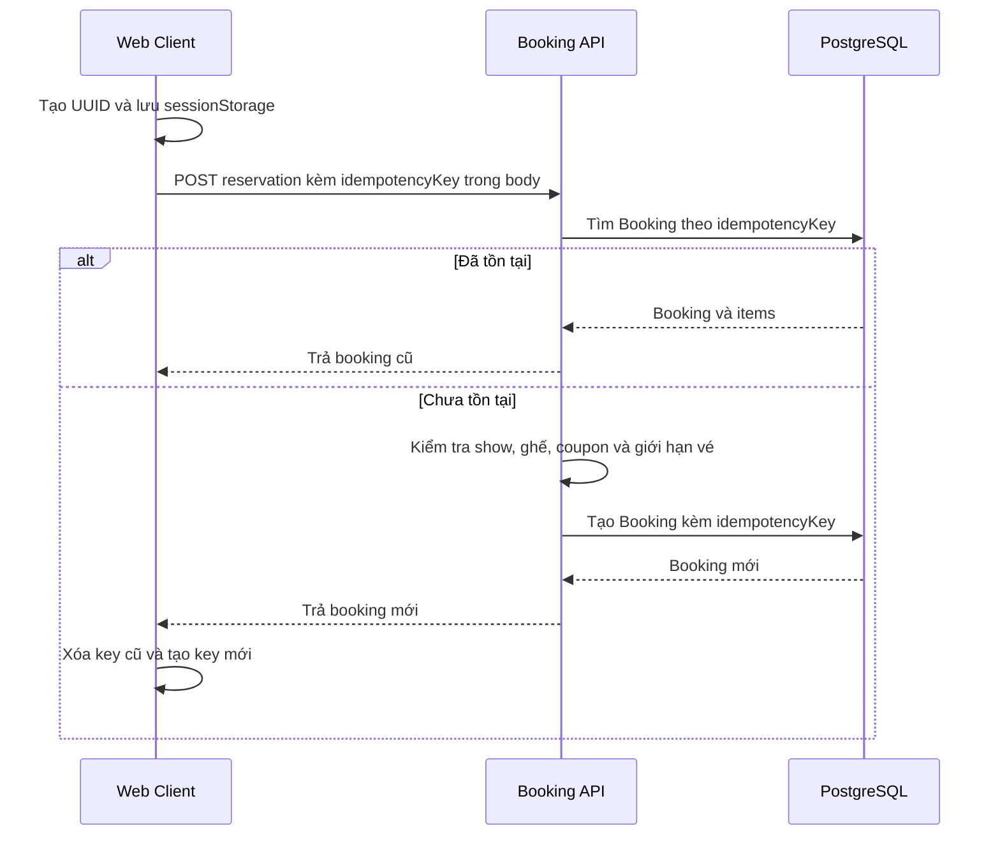

# Thiết kế Idempotency Key

**Ngày kiểm tra:** 15/07/2026  
**Phạm vi:** Booking, payment và các luồng có khả năng được gửi lại  
**Mục tiêu:** Đối chiếu cơ chế idempotency, payload hashing và TTL Redis với mã nguồn hiện tại

## Hiện trạng triển khai

Cơ chế idempotency hiện chỉ được triển khai một phần cho API tạo booking.

| Thành phần | Hiện trạng |
|---|---|
| Phạm vi | POST /bookings/reservations |
| Sinh key | Web client dùng crypto.randomUUID() |
| Lưu phía client | sessionStorage theo eventId để giữ key khi tải lại trang |
| Cách truyền | Thuộc tính idempotencyKey trong JSON body |
| Bắt buộc | Không, DTO cho phép bỏ trống |
| Nơi lưu | Cột Booking.idempotencyKey trong PostgreSQL |
| Ràng buộc | Unique toàn cục trên idempotencyKey |
| Xử lý request lặp | Tìm booking theo key và trả booking đã tồn tại |
| Payload hashing | Chưa triển khai |
| Redis cho idempotency | Chưa triển khai |
| TTL của idempotency key | Chưa có |
| Payment idempotency | Chưa triển khai |

Booking.expiresAt có thời hạn giữ chỗ 15 phút nhưng không phải TTL của idempotency key. Key vẫn tồn tại cùng bản ghi booking sau khi booking hết hạn.

## Luồng tạo booking hiện tại

Redis trong BookingService chỉ được dùng cho khóa theo show và khóa ghế. Các key này không lưu kết quả request và không đóng vai trò idempotency key.

## Kiểm tra payload hashing

Mã nguồn không chuẩn hóa payload, không tạo hash và không lưu hash cùng idempotency key. Vì vậy:

- Cùng một key và cùng payload: booking cũ được trả lại.
- Cùng một key nhưng khác show, ghế hoặc coupon: service vẫn trả booking gắn với key cũ nếu vượt qua các bước kiểm tra được thực hiện trước truy vấn key.
- API không trả lỗi xung đột để báo key đã được dùng cho payload khác.

Các chỗ dùng createHash trong dự án phục vụ refresh token và chữ ký lưu trữ, không liên quan tới idempotency của booking.

## Kiểm tra TTL Redis

Không có Redis key dành cho idempotency nên cũng không có TTL Redis tương ứng. Unique key trong PostgreSQL không có trường expiresAt riêng và không có job dọn dẹp idempotency key.

| Redis key liên quan booking | TTL | Mục đích |
|---|---:|---|
| lock:show:{showId}:booking | 5 giây | Mutex ngắn hạn khi tạo booking |
| seat_lock:{seatId} | 15 phút | Giữ ghế tạm thời |
| Idempotency key | Không có | Chưa triển khai trên Redis |

## Rủi ro quan trọng

1. **Key không gắn với người dùng:** truy vấn booking chỉ dựa trên idempotencyKey. Nếu một người dùng cung cấp được key của người khác, API có thể trả booking không thuộc sở hữu của họ.
2. **Không phát hiện payload thay đổi:** dùng lại key với nội dung khác không tạo lỗi 409 và có thể trả kết quả của request trước.
3. **Xử lý race condition chưa đầy đủ:** unique constraint bảo vệ việc ghi trùng nhưng service không bắt lỗi unique constraint rồi đọc lại booking đã tạo thành công.
4. **Không có thời hạn key:** key tồn tại theo vòng đời bản ghi booking, khiến phạm vi chống gửi lại không được kiểm soát rõ ràng.
5. **Payment chưa có idempotency:** gọi lặp API tạo payment có thể tạo nhiều bản ghi PENDING và nhiều URL thanh toán cho cùng booking.

## Thiết kế đề xuất

Idempotency nên được tách thành bản ghi request độc lập thay vì chỉ gắn key vào Booking.

### Định danh và phạm vi

- Nhận Idempotency-Key qua HTTP header và bắt buộc với các API tạo booking, payment.
- Ràng buộc duy nhất theo userId, operation và key; không dùng key toàn cục độc lập.
- Trước khi trả tài nguyên cũ, luôn kiểm tra tài nguyên thuộc đúng người dùng hiện tại.

### Payload hashing

1. Chuẩn hóa các trường nghiệp vụ có ảnh hưởng đến kết quả theo thứ tự ổn định.
2. Tạo SHA-256 từ payload đã chuẩn hóa.
3. Lưu payloadHash cùng key, trạng thái và kết quả request.
4. Nếu key trùng và hash trùng, trả lại kết quả trước đó.
5. Nếu key trùng nhưng hash khác, trả HTTP 409 Conflict.

Ví dụ dữ liệu cần đưa vào hash của booking: userId, showId, danh sách seatId hoặc ticketTypeId và quantity, couponCode. Không đưa timestamp, access token hoặc trường trình bày vào hash.

### Lưu trữ và TTL

PostgreSQL nên là nguồn bền vững cho trạng thái request. Redis có thể làm lớp tra cứu nhanh và khóa xử lý ngắn hạn.

| Lớp | Key đề xuất | Dữ liệu | Thời hạn đề xuất |
|---|---|---|---:|
| Redis | idem:{operation}:{userId}:{key} | payloadHash, trạng thái, resourceId | 24 giờ |
| PostgreSQL | Unique(userId, operation, key) | payloadHash, trạng thái, response hoặc resourceId, expiresAt | Dọn theo expiresAt |

Mốc 24 giờ là giá trị thiết kế đề xuất, không phải cấu hình đang có trong dự án. TTL thực tế cần dài hơn khoảng thời gian client có thể retry và khoảng thời gian trạng thái payment còn chưa xác định.

### Xử lý đồng thời

- Tạo bản ghi trạng thái PROCESSING bằng thao tác atomic hoặc transaction.
- Request cùng key đang xử lý nhận 409 hoặc 202 kèm trạng thái rõ ràng.
- Khi gặp lỗi unique constraint do hai request đồng thời, đọc lại bản ghi idempotency và áp dụng quy tắc so sánh hash.
- Chỉ lưu SUCCEEDED sau khi giao dịch nghiệp vụ hoàn tất; lưu FAILED có chọn lọc để xác định request nào được phép retry.

## Kịch bản kiểm tra

| Kịch bản | Kết quả mong đợi sau khi hoàn thiện |
|---|---|
| Cùng user, key và payload | Trả cùng booking/payment, không tạo bản ghi nghiệp vụ mới |
| Cùng user và key, payload khác | HTTP 409 Conflict |
| Hai user dùng cùng key | Xử lý độc lập |
| Hai request đồng thời cùng key | Chỉ một request tạo tài nguyên |
| Retry sau khi API trả kết quả không rõ ràng | Trả lại trạng thái hoặc kết quả đã lưu |
| Key đã hết TTL | Được xử lý theo chính sách hết hạn đã công bố |
| Gọi lặp tạo payment | Không tạo nhiều payment PENDING cho cùng thao tác |

## File code đối chiếu

- src/apps/ui/web/src/features/checkout/SeatSelectionPage.jsx
- src/apps/ui/web/src/shared/services/api.js
- src/apps/backend/src/bookings/booking.dto.ts
- src/apps/backend/src/bookings/booking.service.ts
- src/apps/backend/src/payments/payment.service.ts
- src/apps/backend/prisma/schema.prisma
- src/apps/backend/src/redis/redis.service.ts

