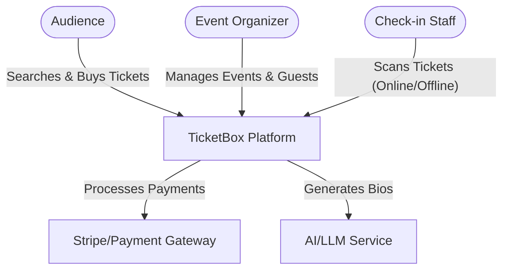
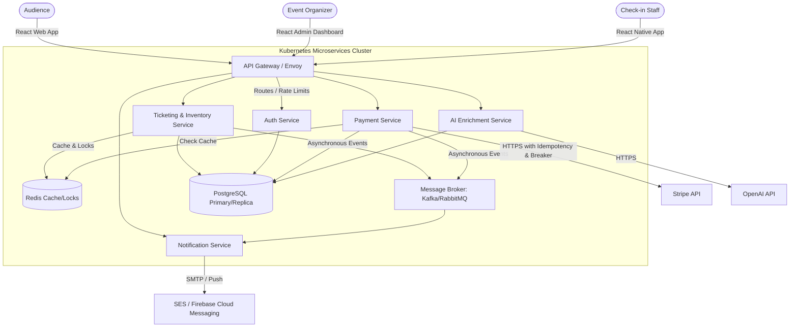
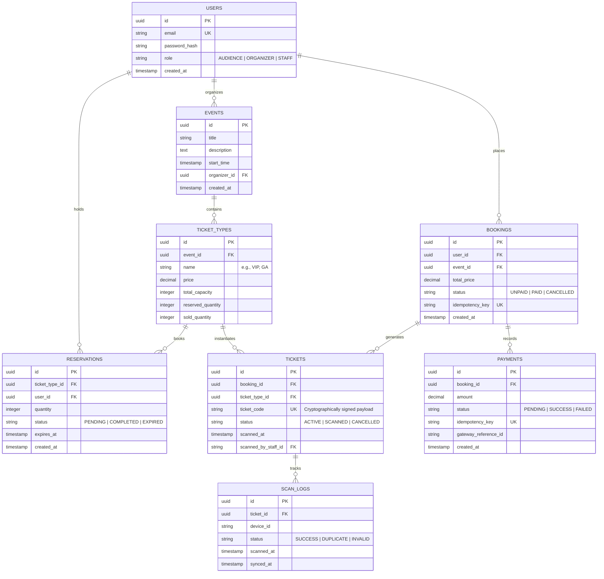
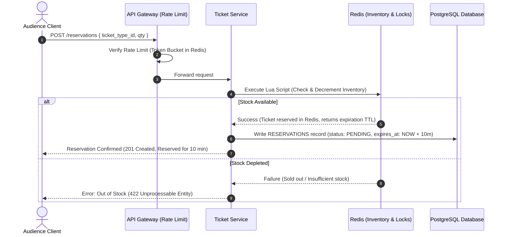

## Context

TicketBox is a high-performance concert ticketing platform designed to handle massive spikes in demand (e.g., 80,000 concurrent users at peak ticket sales) without failing, overselling tickets, or double-charging customers. The system must support diverse interfaces (Web, Admin, Mobile) and feature robust offline check-in synchronization, AI enrichments, role-based security, and circuit-breaker resilient integrations.

## Goals / Non-Goals

**Goals:**
- **High Concurrency & Low Latency**: Handle 80,000 concurrent users during hot sales with response times under 100ms for reservation.
- **Zero Overselling & Zero Double Payments**: Enforce strict consistency on ticket stock and exactly-once processing for payment gateway transactions.
- **Offline Reliability**: Support seamless ticket check-in at remote concert venues with poor network connectivity, resolving conflict synchronization later.
- **Role-Based Access**: Define strict access boundaries for Audience (purchase), Organizers (event/CSV management, AI generation), and Check-in Staff (scanning).
- **Asynchronous Scalability**: Deliver fast notifications via an event-driven architecture using Kafka or RabbitMQ.

**Non-Goals:**
- Building full-blown payment gateway providers (we integrate with external services like Stripe).
- Implementing our own LLM model (we utilize commercial LLM APIs via LangChain/OpenAI).
- Real-time video streaming of concerts.

## High-Level Architecture

### System Context (C4 Level 1)

### Container Diagram (C4 Level 2)

## Database Design

To support microservices and ensure transaction safety, we use a single logical PostgreSQL instance with service-specific schemas, or separate physical databases for high-traffic domains.

### High-Concurrency Reservation Flow
To avoid database bottlenecks when 80,000 users attempt to reserve tickets simultaneously, inventory checks and temporary allocations are performed in Redis.

## Decisions

### ADR 1: API Rate Limiting Pattern
- **Options**:
  - *Option A (Nginx IP Limiting)*: Easy to configure, but lacks flexibility (cannot limit by JWT claims or user roles, hard to customize headers).
  - *Option B (Distributed Token Bucket in Redis at API Gateway)*: (Chosen) Standardizes rate limiting globally. Protects microservices from spikes by enforcing a maximum bucket size (e.g., 100 requests/sec for standard users, 10 requests/sec for guests, and higher for staff) using a fast Redis script.
- **Rationale**: Mitigates DDoS attacks during peak sale events and ensures equal access to backend resources.

### ADR 2: Concurrent Ticket Reservation & Inventory Locks
- **Options**:
  - *Option A (Pessimistic DB Locks - SELECT FOR UPDATE)*: Safe but slow. Database connections will saturate and lock timeouts will crash the application during hot sales under 80,000 concurrent requests.
  - *Option B (Optimistic DB Locking)*: Avoids table locks but creates extremely high transaction rollback rates, degrading performance and causing terrible user experience (repeated transaction failures).
  - *Option C (Redis-based Pre-reservation with Lua Scripting)*: (Chosen) Evaluates and decrements ticket inventory in single-threaded Redis memory (<1ms). Updates DB asynchronously or via lightweight transactions to persist the reservation.
- **Rationale**: Ensures sub-millisecond response times, protects PostgreSQL from thread exhaustion, and guarantees no overselling because Redis inventory decreases are atomic.

### ADR 3: Double Payment Prevention and Idempotency
- **Options**:
  - *Option A (Client-side disabling of buttons)*: Fails if the user refreshes, has poor network, or uses API scripts directly.
  - *Option B (Backend Idempotency Keys + DB Unique Constraints)*: (Chosen) Clients MUST supply a unique `Idempotency-Key` (UUIDv4 generated during checkout start) in headers. The Payment Service writes this key with a `PENDING` state to Redis/Postgres. Any subsequent request with the same key within a 24-hour window will block (if pending) or return the cached response (if completed). A PostgreSQL unique constraint on `payments.idempotency_key` serves as the ultimate safety net.
- **Rationale**: Guarantees exactly-once charge execution, preserving buyer trust and preventing catastrophic financial reconciliation discrepancies.

### ADR 4: Circuit Breaker for External Payment Gateways
- **Options**:
  - *Option A (Direct HTTP calls with retry)*: Retries will worsen the congestion if the Payment Gateway is experiencing downtime, causing database connections in the Payment Service to hang indefinitely.
  - *Option B (Circuit Breaker Pattern - Opossum / NestJS)*: (Chosen) Monitors payment API errors. If failures exceed 50% in a 30-second window, the breaker "trips" (opens) for 10 seconds. During this time, all checkout requests fail fast with a custom error message ("Payment provider temporarily congested, try again in a few seconds") without calling the gateway.
- **Rationale**: Isolates dependency failures, prevents service degradation cascade, and keeps backend resources available for non-payment activities (e.g., ticket browsing).

### ADR 5: Offline Mobile Check-in Synchronization
- **Options**:
  - *Option A (Always Online Verification)*: Unacceptable at concert venues with concrete structures or remote locations where cell signals fail.
  - *Option B (Local SQLite Cache with Signature Verification & Asynchronous Sync)*: (Chosen) Before the event, check-in staff download the guest list and event public keys to their mobile app (secured locally in encrypted SQLite). Scanned ticket QR codes contain a cryptographically signed JSON Web Token (JWT) representing the ticket details. The app decodes and verifies the signature offline using the local public key. Scans are logged locally. Once internet connectivity is restored, scan logs are pushed to the backend via a queue.
- **Conflict Strategy**: First sync wins. If a ticket is scanned offline on two different devices, the backend accepts the first uploaded scan log as `SUCCESS` and flags the subsequent sync as a `DUPLICATE` alert in the dashboard.
- **Rationale**: Guarantees fast, 100% reliable entry processing under any network conditions.

### ADR 6: Event-Driven notifications via Message Broker
- **Options**:
  - *Option A (Synchronous HTTP/SMTP from Ticket Service)*: Delays checkout responses (SMTP handshakes take 1-3 seconds), and any mail server failure will rollback the checkout transaction.
  - *Option B (Event-Driven Broker - RabbitMQ / Kafka)*: (Chosen) The Ticketing/Payment services emit `booking.confirmed` or `payment.success` events to RabbitMQ/Kafka. The Notification Service consumes these events asynchronously and triggers SMTP (via AWS SES) or Push Notifications (via FCM) in the background.
- **Rationale**: Decouples payment/booking logic from messaging, improves checkout performance, and provides automatic retry mechanisms for failed email/push delivery attempts.

## Risks / Trade-offs

- **[Risk] Redis Cluster Failure**: If Redis crashes, our high-concurrency reservation system goes down.
  - *Mitigation*: Deploy Redis with multi-zone replication (sentinels or clustering) and enable persistent Append-Only Files (AOF) with regular database-synchronized fallbacks.
- **[Risk] Out-of-sync Local Mobile Databases**: Staff devices might have outdated guest lists if late ticket sales occur during the event.
  - *Mitigation*: Implement delta-updates. Whenever the mobile device has a network signal (even weak), it pulls only the tickets created since the last sync timestamp.
- **[Risk] PDF Parsing Errors for LLM Bios**: Poorly formatted or scanned PDFs might lead to garbage text, causing the LLM to generate inaccurate or hallucinated artist bios.
  - *Mitigation*: Use a robust OCR parser (e.g., pdf-parse or Tesseract) combined with structural LLM prompts (JSON Schema output validation) that flag low-confidence parses for human review.

## Migration Plan

1. **Phase 1: Environment Scaffolding**: Setup Docker, Kubernetes, PostgreSQL Primary-Replica, Redis, and RabbitMQ.
2. **Phase 2: Database Schema & Core APIs**: Deploy the core PostgreSQL migrations, Auth Service, and Event Management.
3. **Phase 3: High-Throughput Engine**: Implement Redis Lua scripts for inventory reservation alongside unit load tests mimicking 80k users.
4. **Phase 4: Resilient Checkout**: Deploy Payment Service with Stripe integration, idempotency filters, and circuit breakers.
5. **Phase 5: Offline Scan Sync**: Develop the offline cryptographic scanning logic on React Native and the background synchronization protocol.
6. **Phase 6: AI features & Notifications**: Implement PDF extraction, LLM bio-enrichments, and RabbitMQ-based asynchronous notifications.
